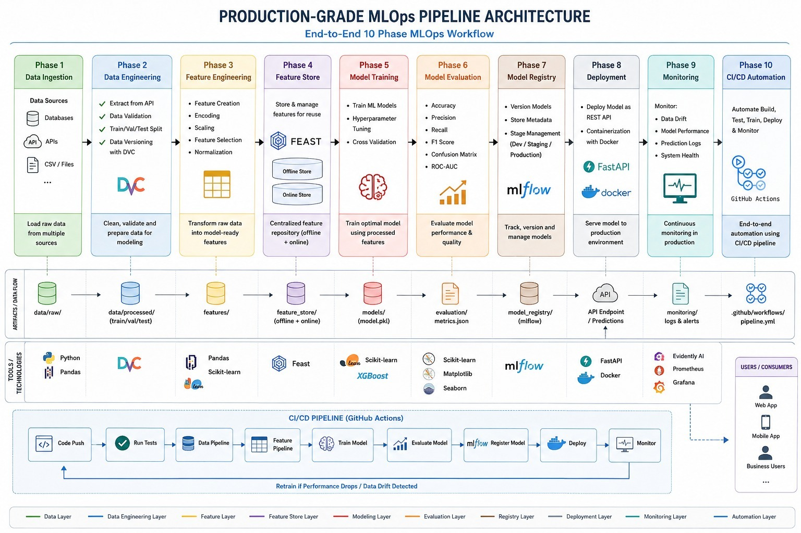

# Churn Prediction MLOps Pipeline

A production-grade, end-to-end MLOps pipeline built entirely with free and open-source tools — from raw data to a live, monitored, auto-deploying prediction API.

**Live API:** https://churn-prediction-api-6oo8.onrender.com/docs
**Experiment tracking:** https://dagshub.com/loveenair28/mlops-architecture.mlflow

---

## Architecture



The pipeline follows a 10-phase workflow, each with its own artifacts, tools, and quality gates:

| Phase | Purpose | Tools |
|---|---|---|
| 1. Data Ingestion | Load raw customer data | Python, Pandas |
| 2. Data Engineering | Validate, split, version data | DVC, DagsHub |
| 3. Feature Engineering | Encode, impute, transform features | Pandas, Scikit-learn |
| 4. Feature Store | Centralized, consistent feature serving | Feast |
| 5. Model Training | Train + tune with cross-validation | Scikit-learn, XGBoost |
| 6. Model Evaluation | Score against a quality gate | Scikit-learn |
| 7. Model Registry | Version and stage models | MLflow (hosted on DagsHub) |
| 8. Deployment | Serve predictions via REST API | FastAPI, Docker, Render |
| 9. Monitoring | Detect data drift in production | SciPy (KS-test) |
| 10. CI/CD Automation | Auto-train, build, and deploy on push | GitHub Actions |

---

## What this project does

Predicts whether a telecom customer will churn (cancel their service), using 250,000 customer records with 32 raw features (demographics, billing, usage, and support history). The model outputs a churn probability and a binary prediction, served through a live REST API.

**Problem type:** Binary classification
**Model:** XGBoost, tuned via `GridSearchCV` with 3-fold cross-validation, `class_weight` adjusted for the ~10% churn rate in the data
**Evaluation metric:** F1 score (accuracy is misleading on this imbalanced dataset — see `docs/problem_definition.md`)

---

## Project structure

```
├── data/
│   ├── raw/                  # Original + sampled customer data (DVC-tracked)
│   └── processed/            # Train/val/test splits (DVC-tracked)
├── features/                 # Engineered features per split (DVC-tracked)
├── feature_store/
│   └── churn_repo/           # Feast feature definitions and online store
├── models/                   # Trained model + feature schema (DVC-tracked)
├── evaluation/                # Evaluation metrics, decision threshold
├── monitoring/
│   └── logs/                  # Prediction logs, drift reports
├── src/
│   ├── data_validation.py     # Phase 2
│   ├── split_data.py          # Phase 2
│   ├── build_features.py      # Phase 3
│   ├── convert_to_parquet.py  # Phase 4
│   ├── train.py                # Phase 5 + 7 (training + registry)
│   ├── evaluate.py             # Phase 6
│   ├── app.py                  # Phase 8 (FastAPI service)
│   ├── drift_check.py          # Phase 9
│   ├── check_live_drift.py     # Phase 9
│   └── pipeline.py             # Orchestrates phases 2-6 as one pipeline
├── tests/
│   └── test_api.py             # API test suite
├── .github/workflows/
│   └── pipeline.yml            # Phase 10 (CI/CD)
├── Dockerfile
├── requirements.txt            # Full dev/training environment
└── requirements-api.txt        # Minimal API-serving environment
```

---

## Running it locally

```bash
git clone https://github.com/lovee1234456/mlops-architecture.git
cd mlops-architecture
python -m venv venv
venv\Scripts\activate          # Windows
pip install -r requirements.txt
```

Run the full training pipeline:

```bash
python -m src.pipeline
```

Start the API:

```bash
uvicorn src.app:app --reload
```

Then visit `http://127.0.0.1:8000/docs` for the interactive API explorer.

---

## Running with Docker

```bash
docker build -t churn-api .
docker run -p 8000:8000 churn-api
```

---

## CI/CD

Every push to `main` triggers `.github/workflows/pipeline.yml`, which:

1. **`run-pipeline`** — validates data, retrains the model, evaluates it against a minimum F1 threshold. If the model doesn't meet the threshold, the workflow stops here and nothing downstream runs.
2. **`build-and-deploy`** — (only if step 1 succeeds) builds a fresh Docker image with the new model, pushes it to Docker Hub, and triggers a redeploy on Render.

---

## Data & experiment versioning

- **Data and model artifacts** are versioned with [DVC](https://dvc.org), stored on [DagsHub](https://dagshub.com)'s free remote storage.
- **Experiments and model registry** are tracked with [MLflow](https://mlflow.org), hosted free on DagsHub.

To pull the versioned data/model artifacts after cloning:

```bash
dvc pull
```

---

## Known limitations

- Model F1 score (~0.27) reflects a first-pass tune on a genuinely imbalanced, moderately noisy dataset — see `docs/problem_definition.md` for the baseline this was measured against.
- The feature store's schema currently excludes one-hot encoded categorical columns for stability; base numeric/boolean features are fully live.
- Render's free tier spins down after inactivity — the first request after idle time may take 30-60 seconds.

---

## License

This project was built as a learning exercise in production MLOps practices.
